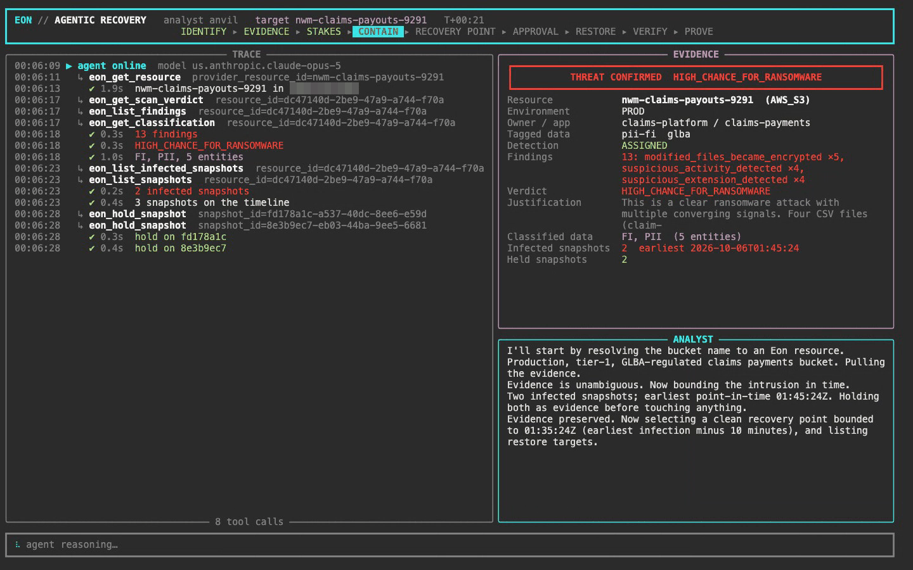
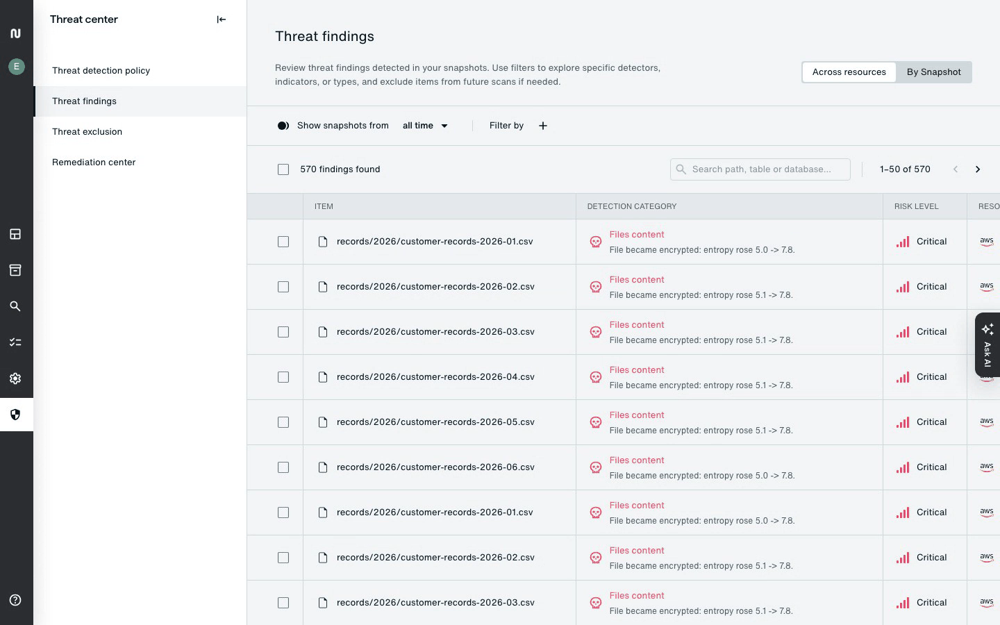
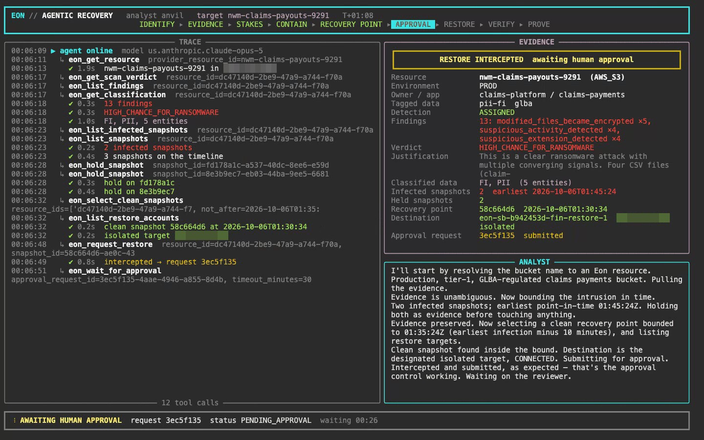
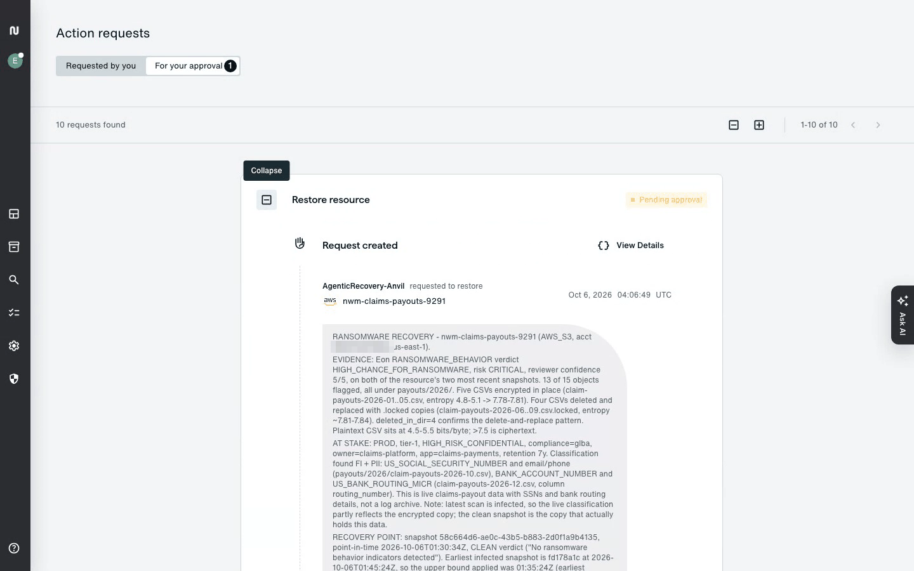
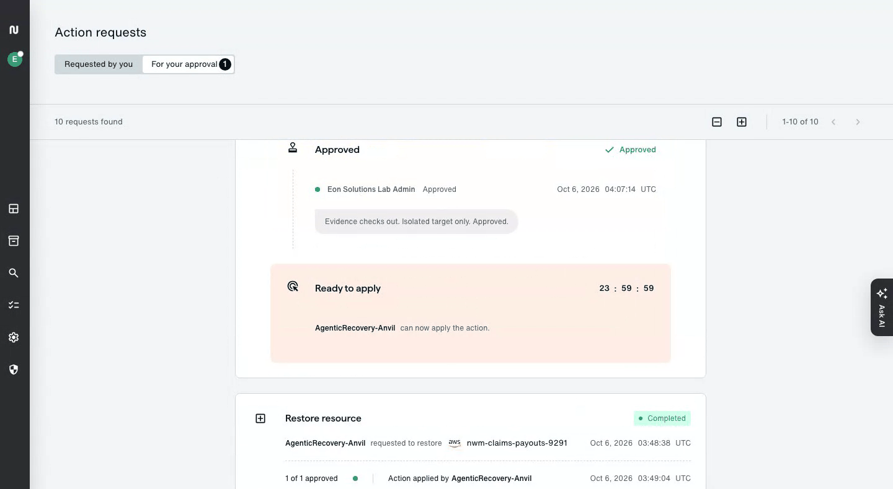
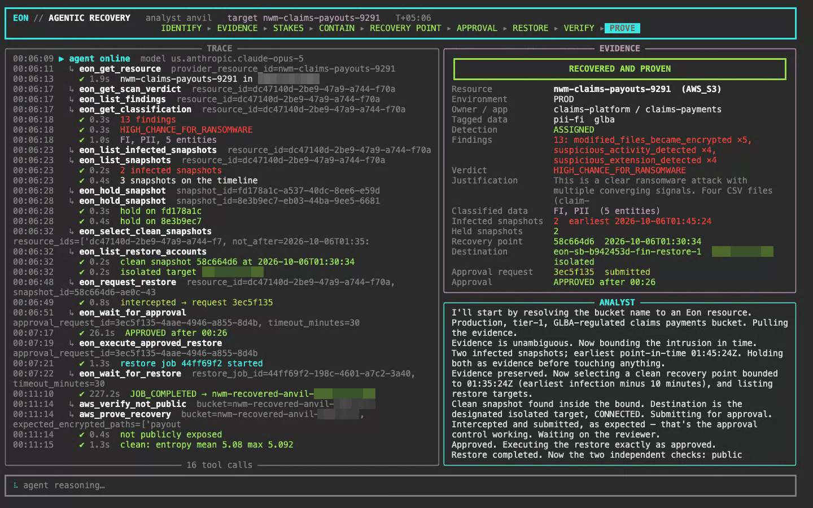

# Break It, Fix It, Prove It

An agent that works a ransomware incident end to end against a real backup platform:
it investigates the attack Eon detected on your bucket, picks the last clean recovery
point before the intrusion, proposes a restore that a human has to approve, carries
out the approved restore into an isolated account, and then proves the recovered copy
is clean with checks that do not depend on Eon.



Your kit is already configured. The `.env` next to this file carries your seat: your
bucket, your recovery bucket, and credentials that can reach exactly those and nothing
else.

## From the kit link to a running agent

1. **Download.** Your personal link downloads `agentic-recovery-<codename>.zip`. It is
   yours alone and stops working after the workshop; if it returns an error, ask the
   organiser for a fresh one.

2. **Unzip** it somewhere you can find from a terminal. The folder holds this repository
   plus two files of your own: `.env` (your seat: bucket names, the Eon tenant, and an AWS
   access key that reaches only your seat's resources) and `BUILD.txt` (which build you
   have). Treat the folder like a password. Do not share the zip, do not paste `.env`
   anywhere, do not commit it.

3. **Install `uv`**, once. It fetches Python and the dependencies for you; nothing else is
   needed, not even a Python install.

   macOS / Linux:

   ```sh
   curl -LsSf https://astral.sh/uv/install.sh | sh
   ```

   Windows (PowerShell):

   ```powershell
   powershell -ExecutionPolicy ByPass -c "irm https://astral.sh/uv/install.ps1 | iex"
   ```

   Then close the terminal and open a new one so `uv` is on your path.

4. **Check the seat** from inside the unzipped folder. This asks the agent a question and
   answers it read-only, so it confirms your credentials without proposing anything:

   ```sh
   uv run agent/main.py --ask "What does Eon know about my bucket?"
   ```

   The first start downloads Python and the dependencies, a minute or two. Later starts
   are instant.

5. **Run the incident** when the room is ready:

   macOS / Linux: `./run.sh`  ·  Windows: `.\run.cmd`  ·  anywhere: `uv run agent/main.py`

   The run takes about ten minutes. It pauses once, when the restore it proposes is
   waiting for a human to approve it in the Eon console. That is the control working:
   the agent can request a recovery, it cannot execute one. Leave it waiting; if you
   restart it, it finds its own pending request and reuses it rather than filing another.
   After approval it restores, verifies and proves, and writes its report to `runs/`.

`--plain` gives a plain text stream instead of the dashboard, for terminals that render
it badly or for piping to a file. On Windows, Windows Terminal or PowerShell 7 render the
dashboard well; the legacy console does not.

### If something does not work

| You see | What it means |
|---|---|
| `uv: command not found` | The installer could not add itself to your path. Open a new terminal, or run `source $HOME/.local/bin/env` (macOS/Linux) |
| `missing settings in .env` | You are not inside the unzipped folder, or your unzip tool dropped the hidden `.env`. Check with `ls -a` and re-extract if it is missing |
| `permission denied because of data access rule` | Your seat sees its own bucket only. Do not pass `--bucket` for a resource that is not yours |
| `InvalidClientTokenId`, `ExpiredToken`, or a 403 from Eon | The seat's credentials have been revoked; they expire after the workshop |
| `ThrottlingException` from Bedrock | The model is shared by the room. The agent retries; give it a moment |
| Nothing connects | The agent needs HTTPS to `*.amazonaws.com` and `*.console.eon.io`. Corporate VPNs and proxies sometimes block one of them; a phone hotspot is the quick fix |

## What a run looks like

The agent reads Eon's threat findings for the bucket: which objects were overwritten with
ciphertext, which were renamed, which were deleted, and the entropy measurements behind
the verdict.



It bounds the intrusion in time, holds the earliest and latest infected snapshots as
evidence, selects the last clean snapshot before the bound, confirms the isolated
destination, and submits a restore request with its reasoning. Eon intercepts the
request and the agent waits.



A reviewer sees the same reasoning in the Eon console, written for a person to act on:
the evidence, the data at stake, the snapshot chosen and why, the destination.



The reviewer approves or denies, with a comment. Both the request and the decision are
logged, and the agent may apply the approved action only within the window that follows.



Once approved, the agent replays the approved request exactly, waits for the restore
job, and then runs two checks of its own against the recovered bucket: that it is not
publicly reachable, and that the recovered objects read as plaintext, not ciphertext.



## Going further

Finished early? Three mock enterprise systems are running for the workshop as MCP servers:
threat intelligence, IT service management with a CMDB, and a data catalog with lineage. They
are optional and the agent does not use them yet. Wiring them in with your own coding
assistant changes what the agent concludes, files and proves.
[docs/mcp-mocks.md](docs/mcp-mocks.md) lists what each one offers and how to connect.

## What is in the box

| Path | What it is |
|---|---|
| `agent/agent.py` | The agent: a Strands Agents SDK agent on Amazon Bedrock, with the runbook it follows |
| `agent/tools_eon.py` | Its Eon tools: inventory, classification, scan verdicts, findings, snapshots, holds, restore and approval |
| `agent/tools_aws.py` | Its AWS-native checks: public exposure, and entropy plus artefact analysis of the recovered objects |
| `agent/ui.py` | The terminal dashboard |
| `agent/agentcore_app.py` | The same agent as an Amazon Bedrock AgentCore Runtime entrypoint, if you want to host it |
| `eonlib/` | A small Eon REST client; the credential is fetched from AWS Secrets Manager at runtime |

## What your credentials can do

- **Eon**: a role scoped to one resource, your bucket. It can read inventory, scan
  results and snapshots for it, hold its snapshots, and request a restore of it into the
  recovery account only. It cannot see other resources, and it cannot approve anything.
- **AWS**: read the one secret that holds the Eon credential, invoke the Bedrock models the
  agent uses, read your recovery bucket, and write its own log stream. Nothing else.

Both expire after the event.

## Taking it home

The agent is configured entirely through `.env`, so pointing it at your own Eon tenant is
a matter of filling in your own values:

| Variable | Purpose |
|---|---|
| `EON_ACCOUNT_DOMAIN`, `EON_PROJECT_ID` | Your Eon tenant and project |
| `EON_SECRET_ARN` | A Secrets Manager secret holding `{"clientId": ..., "clientSecret": ...}` for an Eon API credential. `EON_CLIENT_ID` and `EON_CLIENT_SECRET` in the environment work too |
| `EON_RESTORE_ACCOUNT_ID` | The Eon id of the restore account the agent may recover into |
| `VICTIM_BUCKET`, `RECOVERY_BUCKET` | The bucket under investigation and the bucket to restore into |
| `AWS_ACCESS_KEY_ID`, `AWS_SECRET_ACCESS_KEY`, `AWS_REGION` | An AWS principal that can read the secret, invoke Bedrock and read the recovery bucket |
| `AGENT_MODEL` | A Bedrock model id or inference profile; the kit uses Claude Opus 5 |

Two things make the safety model work and are worth reproducing: give the agent's Eon
credential a role scoped to the resources it should touch, and put an action approval
rule on restores so that every recovery the agent proposes waits for a person.

## License

Licensed under the [Mozilla Public License 2.0](./LICENSE).
